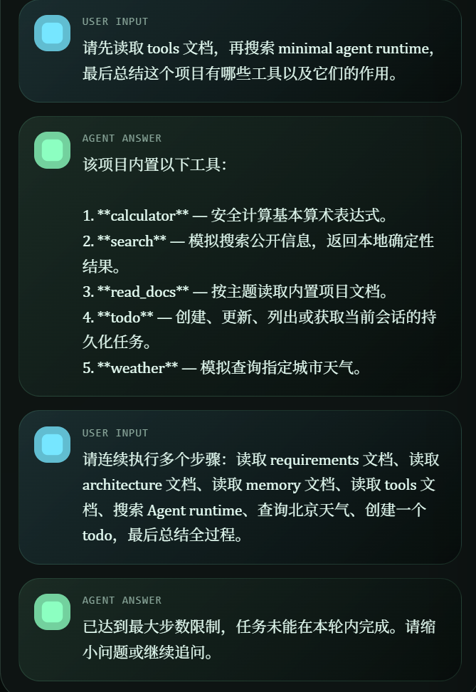
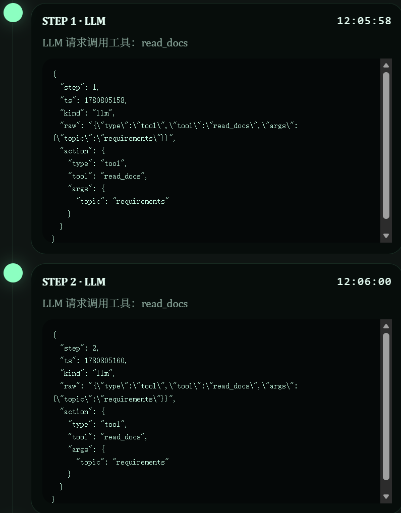
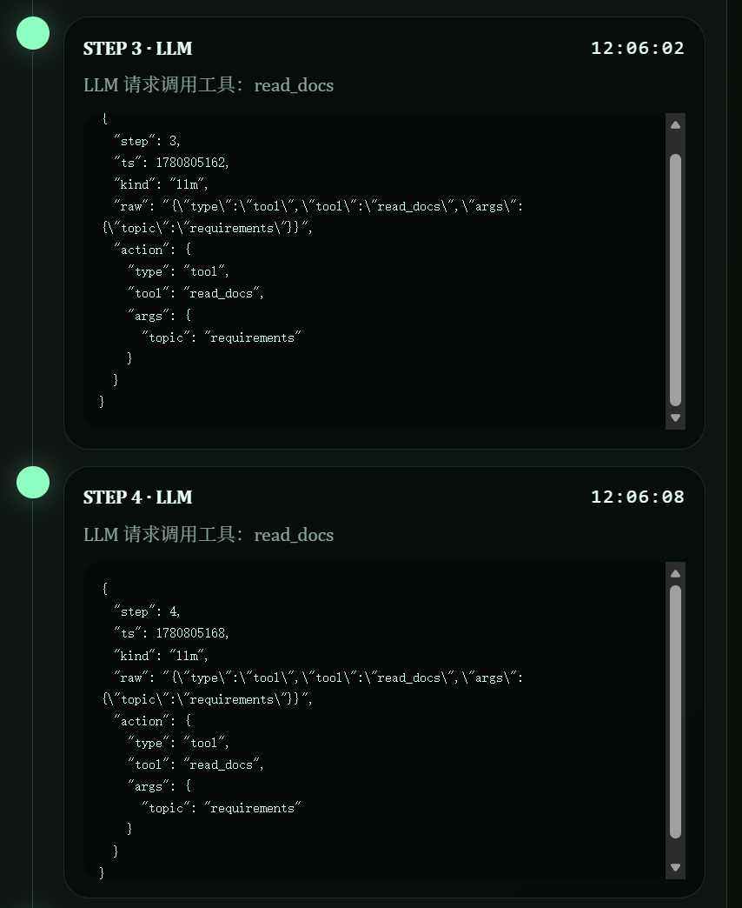
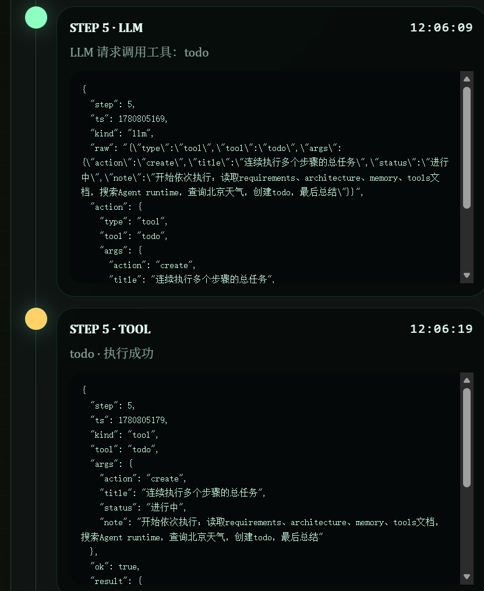
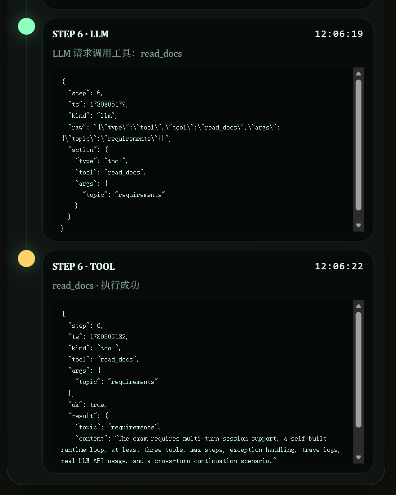

# Minimal Agent Runtime

一个从零实现的最小可用 Agent。核心 Agent runtime 自己实现，不依赖 LangChain、OpenHands 等现成 Agent 框架完成主流程。

## 提交材料

- 代码链接：将本项目推送到 GitHub / Gitee / GitLab 后提交仓库地址。
- 网页操作录屏：[2026-06-07 12-03-26.mp4](./2026-06-07%2012-03-26.mp4)
- README：本文档包含运行方式、系统设计、memory 的召回时机与放置方式说明。
- AI Prompt 与问题解决记录：[AI_PROMPTS_AND_NOTES.md](./AI_PROMPTS_AND_NOTES.md)

## 项目亮点

- 自实现 Agent 主循环：接收用户输入、判断直接回答或调用工具、执行工具、读取工具结果、继续下一步，直到最终答案或达到最大步数。
- 支持多轮对话与 session 维护：同一 session 的 messages、tasks、traces 会持久化到本地 JSON 文件。
- 支持真实 LLM API：兼容 OpenAI Chat Completions 风格接口，可通过 `LLM_BASE_URL` 切换 DeepSeek 等兼容服务。
- 提供 5 个工具：`calculator`、`search`、`read_docs`、`todo`、`weather`。
- 支持跨轮次继续执行：第一轮创建任务，第二轮/第三轮可以基于已有任务状态继续更新或查询。
- 提供可视化前端：展示对话流、工具调用、LLM action、任务状态和 trace 时间线。

## 功能覆盖

| 要求 | 实现情况 |
| --- | --- |
| 多轮对话和 session 维护 | `SessionStore` 按 session id 持久化 messages、tasks、traces |
| 不依赖现成 Agent 框架 | 主循环在 `min_agent/runtime.py` 自实现 |
| 基本循环 | LLM action → 工具执行 → observation → 继续 LLM，直到 final |
| 至少 3 个工具 | 已实现 5 个工具：calculator、search、read_docs、todo、weather |
| 最大步数限制 | `AGENT_MAX_STEPS`，默认 6 |
| 基本异常处理 | LLM、JSON 解析、未知工具、工具执行异常均记录 trace |
| 工具调用 trace | 保存到 `.agent_data/sessions/{session}.json`，前端可视化展示 |
| 跨轮次继续执行 | `todo` 任务保存在 `session.tasks`，后续轮次可继续读取和更新 |
| 真实 LLM API | `min_agent/llm.py` 调用真实 Chat Completions 兼容接口 |
| 终端或网页录屏 | 已提供网页操作录屏链接 |

## 目录结构

```text
.
├── min_agent/
│   ├── cli.py          # CLI 入口
│   ├── llm.py          # 真实 LLM API 客户端，支持 .env
│   ├── runtime.py      # 自实现 Agent 主循环
│   ├── session.py      # session 持久化
│   ├── tools.py        # 工具定义与执行
│   └── web.py          # 前端可视化服务
├── web/
│   ├── index.html      # 可视化页面结构
│   ├── styles.css      # 页面样式
│   └── app.js          # 页面交互逻辑
├── 2026-06-07 12-03-26.mp4   # 网页操作录屏
├── .env.example        # 环境变量模板
├── requirements.txt    # 无第三方运行依赖
├── README.md
└── AI_PROMPTS_AND_NOTES.md
```

## 运行方式

要求 Python 3.10+。项目不需要安装第三方运行依赖，`requirements.txt` 中无运行依赖。

### 1. 配置环境变量

复制环境变量模板：

```powershell
Copy-Item .env.example .env
```

编辑 `.env`，填入真实 LLM API 配置：

```text
LLM_API_KEY=你的 API Key
LLM_BASE_URL=https://api.openai.com/v1
LLM_MODEL=gpt-4.1-mini
LLM_TEMPERATURE=0
AGENT_MAX_STEPS=6
```

如果使用 DeepSeek 等 OpenAI 兼容服务，可改成类似：

```text
LLM_BASE_URL=https://api.deepseek.com/v1
LLM_MODEL=你的模型名
```

### 2. 启动前端可视化页面

```powershell
python -m min_agent.web
```

打开：

```text
http://127.0.0.1:8765/
```

页面支持：

- 输入 Session ID。
- 发送用户消息。
- 查看对话流。
- 查看 LLM / Tool 执行时间线。
- 查看工具调用参数、工具结果和异常 trace。
- 查看 todo 任务状态。

### 3. 使用 CLI 测试

交互模式：

```powershell
python -m min_agent.cli --session demo
```

单轮执行：

```powershell
python -m min_agent.cli --session demo --message "请计算 (12+8)*3"
```

查看 session 文件：

```powershell
Get-Content .agent_data\sessions\demo.json
```

## 网页操作录屏

录屏文件：

[点击查看网页操作录屏](./2026-06-07%2012-03-26.mp4)

录屏展示内容建议包括：

1. 启动 `python -m min_agent.web`。
2. 打开 `http://127.0.0.1:8765/`。
3. 测试 calculator：展示 `LLM → Tool → LLM`。
4. 测试 search / read_docs / weather：展示不同工具调用。
5. 第一轮创建 todo 任务。
6. 第二轮继续任务并更新进度。
7. 第三轮查询任务状态和所有进度说明。
8. 展示右侧 trace JSON，说明 messages、tasks、traces 都被保存。

## 网页运行截图

以下截图展示了前端可视化页面中的多步 Agent 循环、工具调用 trace、最大步数限制和最终回答效果。

> 请将对应截图保存到 `assets/screenshots/` 目录后，README 会自动显示这些图片。


### 最大步数限制最终回答



### 多步循环 Trace：STEP 1-2



### 多步循环 Trace：STEP 3-4



### 工具调用 Trace：todo 创建任务



### 最大步数限制 Trace



## 前端页面测试方式

建议使用同一个 Session，例如 `demo-agent-test`，连续发送以下测试语句。

### 真实 LLM API 与直接回答

```text
你好，请用一句话介绍你自己。
```

预期：出现 `STEP 1 · LLM`，Agent 直接给出回答。

### calculator 工具

```text
请计算 (12+8)*3，并告诉我计算结果。
```

预期：出现 `calculator` 工具调用，结果为 `60`。

### search 工具

```text
请搜索 minimal agent runtime 的资料，并总结两点。
```

预期：出现 `search` 工具调用，并基于 mock search 结果总结。

### read_docs 工具

```text
请读取项目 architecture 文档，并解释这个 Agent 的主循环。
```

预期：出现 `read_docs` 工具调用，参数中 `topic` 为 `architecture`。

### weather 工具

```text
查询一下北京天气。
```

预期：出现 `weather` 工具调用，返回北京 mock 天气。

### 跨轮次继续执行

第一轮：

```text
创建一个任务：整理 Agent 笔试题要求，并记录当前状态为已开始。
```

第二轮：

```text
继续刚才的任务，现在进度怎样？请更新一条进度说明。
```

第三轮：

```text
不要新增内容，只查询刚才任务的当前状态和所有进度说明。
```

预期：

- 第一轮调用 `todo create`，左侧任务状态出现新任务。
- 第二轮调用 `todo get` / `todo update`，同一任务新增进度说明。
- 第三轮调用 `todo get` 或 `todo list`，返回当前任务状态和 notes。
- session 文件中可看到 `messages`、`tasks`、`traces` 均已持久化。

### 多步循环测试

```text
请先读取 tools 文档，再搜索 minimal agent runtime，最后总结这个项目有哪些工具以及它们的作用。
```

预期：同一次用户输入内出现多次 `LLM / TOOL` 交替，直到最终答案。

## 系统设计

### 核心模块

- `min_agent/runtime.py`：Agent 主循环、最大步数、工具执行、trace 记录。
- `min_agent/llm.py`：真实 LLM API 客户端，使用 OpenAI Chat Completions 风格接口。
- `min_agent/tools.py`：工具注册表和工具实现。
- `min_agent/session.py`：session 文件持久化。
- `min_agent/cli.py`：命令行入口。
- `min_agent/web.py`：前端页面与 API 服务入口。

### Agent 主循环

执行流程：

1. CLI 或 Web API 接收用户输入和 session id。
2. `SessionStore` 从 `.agent_data/sessions/{session}.json` 加载历史 messages、tasks、traces。
3. `AgentRuntime` 构造 system prompt，把工具清单、输出 JSON 协议、session 状态摘要放入上下文。
4. LLM 返回 JSON action：
   - `{"type":"final","answer":"..."}`
   - `{"type":"tool","tool":"calculator","args":{"expression":"1+1"}}`
5. 如果 action 是 `final`，保存 assistant 消息并结束本轮。
6. 如果 action 是 `tool`，runtime 执行对应工具并记录 tool trace。
7. 工具 observation 会追加到 messages，再次发送给 LLM。
8. 循环继续，直到得到 final 或达到 `max_steps`。
9. 本轮结束后保存 session。

这个循环满足：接收输入 → 判断是否调用工具 → 执行工具 → 读取工具结果 → 继续下一步 → 给出最终答案。

### 工具设计

- `calculator`：使用 AST 白名单计算基础算术表达式，不使用 `eval`。
- `search`：mock 搜索，返回确定性本地结果，便于稳定演示。
- `read_docs`：读取内置项目文档主题，如 requirements、architecture、memory、tools。
- `todo`：创建、更新、获取、列出当前 session 的任务，用于跨轮次状态验证。
- `weather`：mock 天气查询。

## Memory 的召回时机与放置方式

### 召回时机

- 每次用户输入进入 runtime 前，先通过 `SessionStore.load(session_id)` 加载当前 session。
- 每个 Agent 循环开始前，`_build_messages` 会把当前 session 状态放入 system prompt。
- 工具执行后，trace 立即追加到 `session.traces`。
- 如果工具是 `todo`，任务状态会直接写入 `session.tasks`。
- 本轮结束时，assistant 最终回答写入 `session.messages`，并调用 `SessionStore.save(session)` 持久化。

### 放置方式

- 短期对话记忆：`session.messages`，最近 12 条作为 LLM messages 输入。
- 结构化任务记忆：`session.tasks`，放在 system prompt 的 `Session state` 中，适合跨轮次任务继续执行。
- 工具日志记忆：`session.traces`，完整保存在 session 文件；prompt 中只放最近 5 条，避免上下文无限膨胀。
- 前端可视化：通过 `/api/session?id=...` 读取同一份 session 文件，把 messages、tasks、traces 分别渲染为对话流、任务状态和执行时间线。

## 异常处理与安全

- LLM API 失败会被捕获，写入 LLM trace 的 `error` 字段，并返回兜底错误信息。
- LLM 输出非标准 JSON 时，runtime 会尝试提取 Markdown JSON 代码块或文本中的第一个 JSON 对象。
- LLM 返回空内容时，会追加纠正提示让模型按 JSON 协议重试。
- 未知工具、工具参数错误、工具执行异常都会被捕获并写入 tool trace。
- 对任务状态类请求增加运行时守卫，避免模型口头说“已创建任务”但没有真正调用 `todo` 工具。
- `.env`、`.agent_data`、`__pycache__` 通过 `.gitignore` 排除，避免提交 API Key 和本地运行数据。

## AI Prompt 与问题解决记录

详细记录见：[AI_PROMPTS_AND_NOTES.md](./AI_PROMPTS_AND_NOTES.md)

其中包含：

- 原始开发 Prompt。
- 前端可视化追加需求。
- 使用 AI 辅助开发的方式。
- 关键设计决策。
- 问题与处理记录。
- CLI 和前端验收样例。

## 提交注意事项

- 提交前确认 `.env` 未进入仓库，真实 API Key 不应提交。
- `.agent_data` 是运行时数据，默认不提交。
- 如果平台不支持直接播放仓库内 mp4，可将录屏上传到网盘或 GitHub Release，并把链接替换到“网页操作录屏”部分。
- 本项目没有使用现成 Agent 框架完成主流程。
- `requirements.txt` 中无第三方运行依赖。
